# be-assessment-2
 
## Partners&Pets
Partners&Pets is a datingsite for people who like (and have) pets. On this datingsite they kan find other people who are into pets. You are being matched by which pet you like and what you look for in partner.
 
To register for this datingsite you have to fill in a form with your information and you have to answer two questions about pets of course.
 
When you filled in the form to register, at the moment, you only get matched with the people who have the gender you prefer as a partner.
 
### Description Partners&Pets
On the index page is an explanation about the site. It contains what the site is for and a little bit about how it works.
From the index page you can go to the log-in page and register page. You can only get to those pages, because the user is still logged in yet or they don't have an account yet. And when you are not logged in or do not have an account, you can't get to your matches or your own profile.  
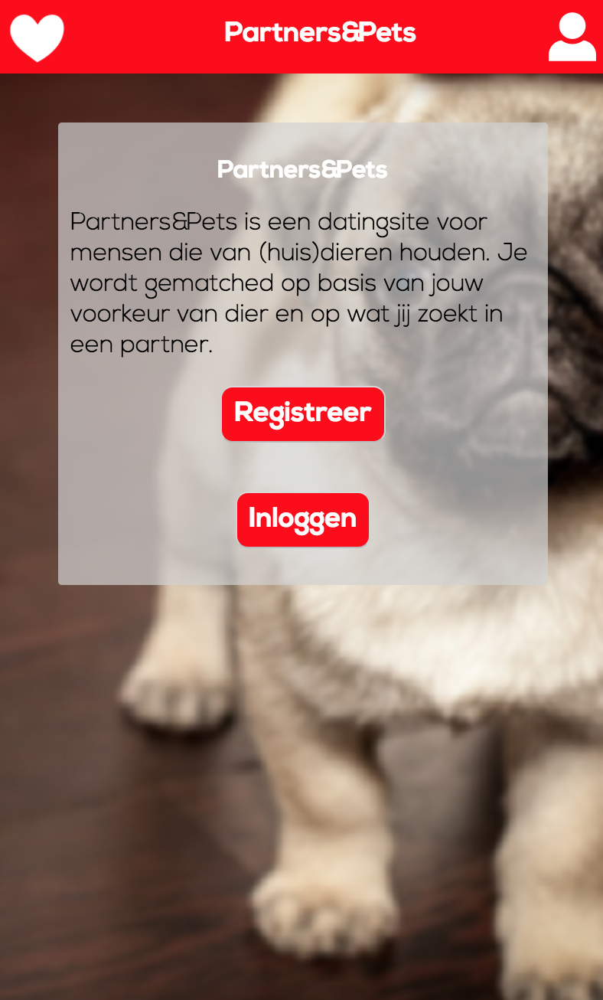 
 
On the register page, user can register for the datingsite. They fill in their information en click on the button on the bottom of the page. On this page are two questions users have to answer about the pets they like.
The only page you can navigate to, when you are on the register page, is the log-in page. Anywhere you can navigate to another page you go to the log-in page, because you are not registered or logged in yet.  
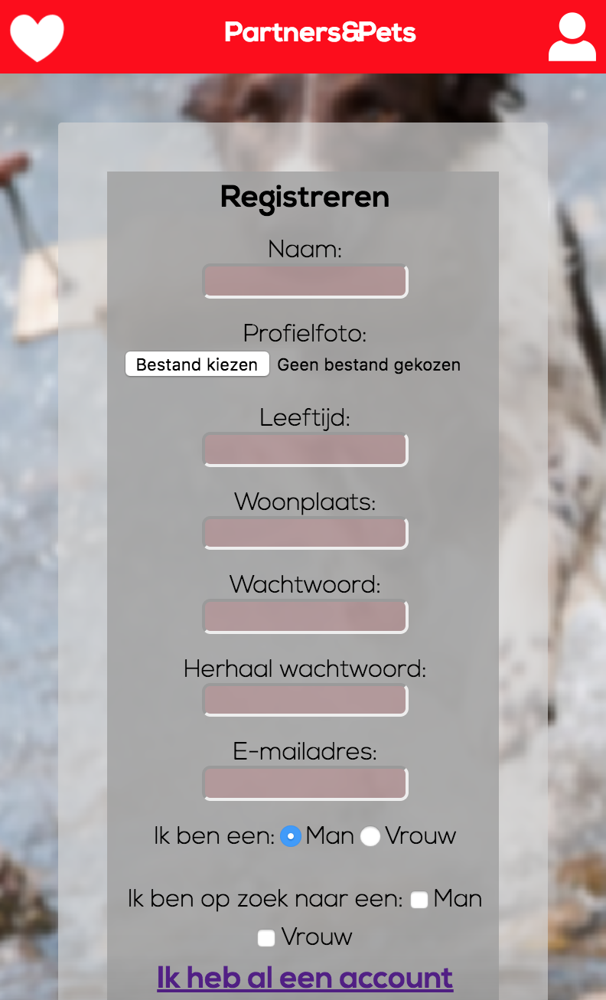
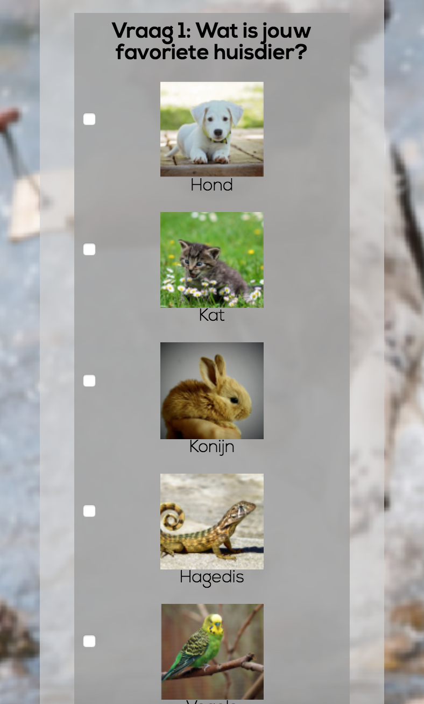
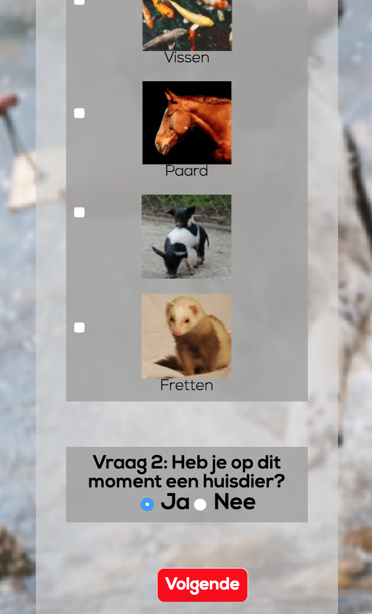
   
On the login page user can login to their profile. 
Anywhere you click on this page navigates to the log-in page. So you stay on the same page when you click somewhere else.
But when you click on the name of the datingsite in the middle at the top of the page you go to the index page. From there you can navigate to the register page and the log-in page.  
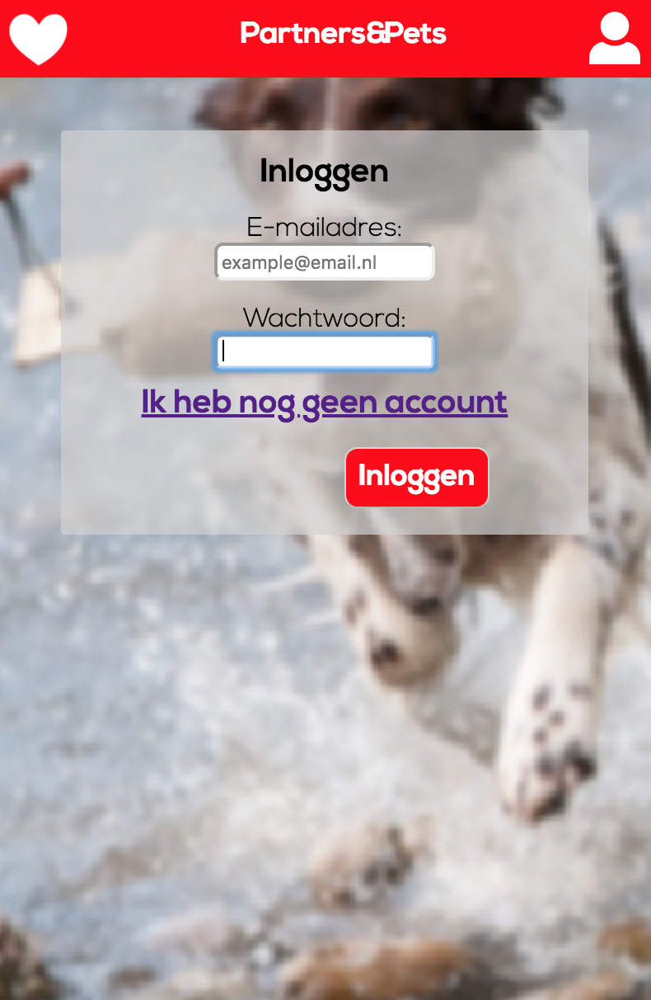
   
On the profile page users can see the information they filled in, in the register form.
From the profile page, users can navigate to the matches page, update page and they can delete their account.
Users can also log-out from this page.  
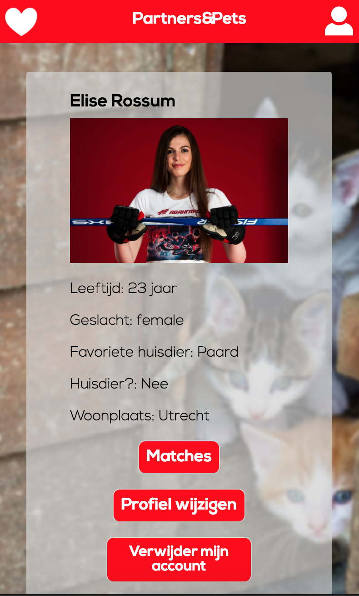
 
On the update page users can update some of their information en save this. The information they changed also changed on their profile page.  
When users want to navigate to a different page while they are filling in the update form, the don't change their information because they did not submit their information.  
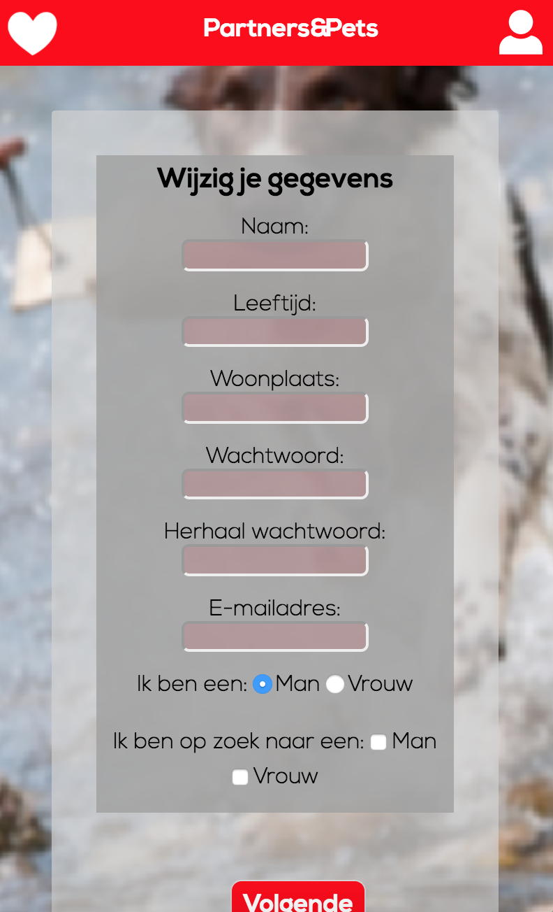
 
On the matches page user can see other users who might be interesting for them to talk to.
The users can go to the detail page of one match or they can click on the chat button and communicate immediately with the other user.  
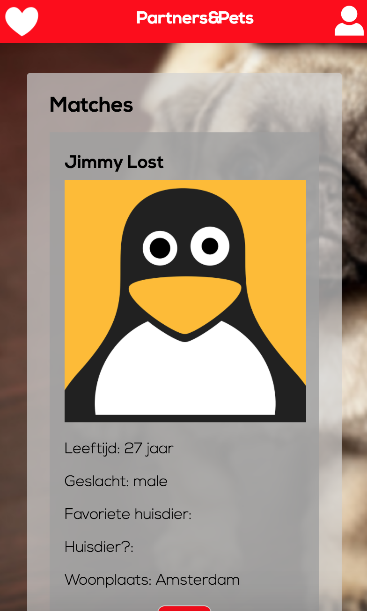
 
On the detail page of one of the matches, user can see the information an other user filled in, in the register form. On the detail page is an oppotunity to chat with the other user.  
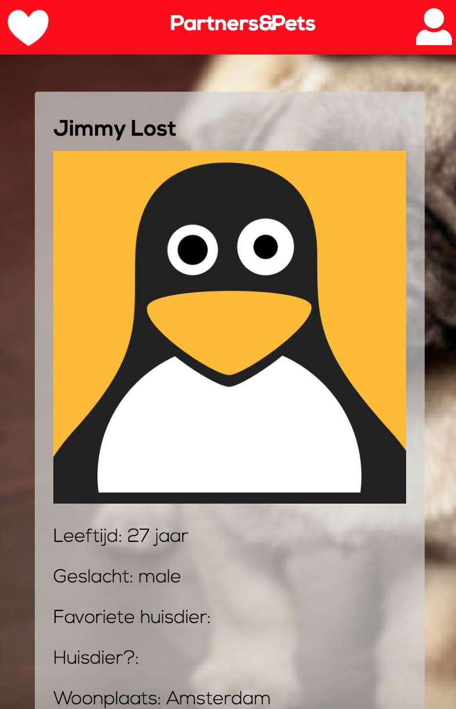
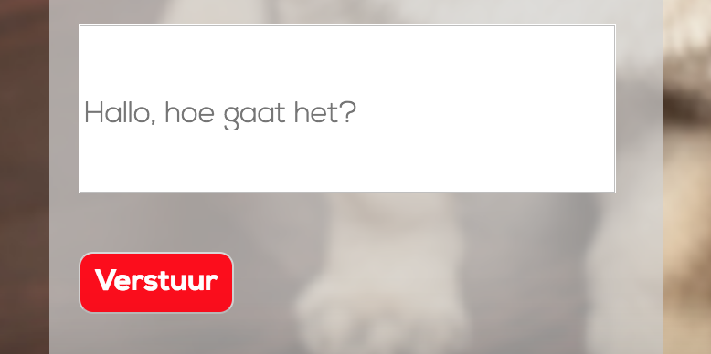
 
On every page the user can click on the profile icon. When the user clicks on the profile icon, there is a dropdown menu with two options. Profile and logout. The user can go to their profile and logout at any time they want.
When te user is not logged in on the site, the log-out button becomes the log-in button.  
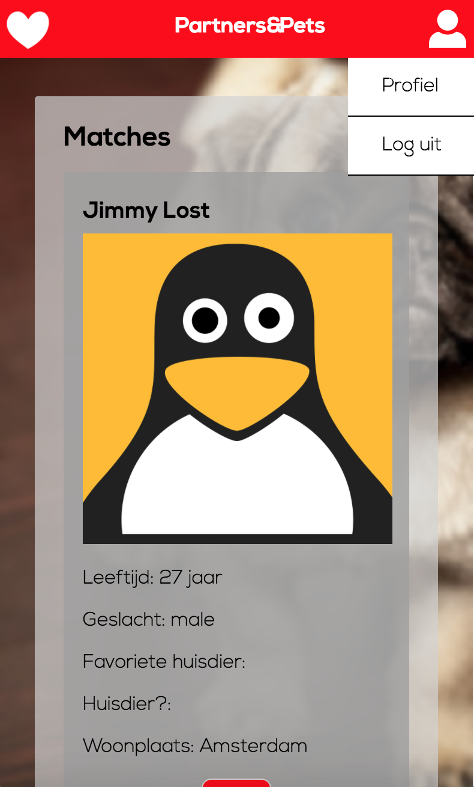 

## Install Partners&Pets
To install Partners&Pets you have to follow a few steps:

You need to change directory in your terminal first to the folder where you want to install everything. 
Use `cd` in your terminal to get to the place where you want to install on you computer.  
Example:
`cd folder_name`
 
To clone the repository
```
git clone https://github.com/LindadeHaan/be-assessment-2.git
cd be-assessment-2
npm install
```
Start server:
```
node server.js
```
 
### package.json
To make a package.json file you have to follow a few steps in your terminal:
```
npm init
```
After `npm init` you just have to fill in what your terminal requires.
In your package.json file you can see which packages you already installed and which packages you still have to install.
 
### Packages
 
* [Express](https://github.com/expressjs/express)
* [EJS](https://github.com/tj/ejs)
* [Body Parser](https://github.com/expressjs/body-parser)
* [Multer](https://github.com/expressjs/multer)
* [MySQL](https://github.com/mysqljs/mysql)
* [Express Session](https://github.com/expressjs/session)
 
How to install a package:
```
npm install package_name
```

## Structure
In the server.js file everything for the whole app comes together. In this file you can see all the code I used to make the  express server and how I alter the MySQL database.
 
### static
In the static folder are my css files, js files, images and uploads. These files are in the static folder, because these files do not change. 
```js
app.use(express.static('static'))
```
With this code, the files in the static folder are available to use.
I have various css files, because like this it is more clear to see what has which style. 
 
### view
In the view folder are all of the ejs templates 
```js
app.set('view engine', 'ejs')
app.set('views', 'views')
```
The view folder contains the `index.ejs`, that is where the `/` is hosted. It also includes the register, log-in, profile, matches and error pages.
 
## Database
I used the MySQL database.
 
Install MySQL:
 
* Install [Homebrew](ttps://brew.sh/index_nl)
* `brew update`
* `brew install mysql`
* Make a connection in your server.js with MySQL 
```js
var connection = mysql.createConnection({
  host: 'localhost',
  user: 'your_username',
  password: '',
  database: 'your_database_name'
})
connection.connect()
```
* Start the MySQL database in the terminal: `mysql -u your_username`
* Go to your database in the terminal so you can work in that database: `use your_database_name`
 
__MySQL works with tables__
 
Create a new table:
```
CREATE TABLE IF NOT EXISTS messages (
  id INT NOT NULL AUTO_INCREMENT,
  name TEXT CHARACTER SET utf8,
  age TEXT CHARACTER SET utf8,
  place TEXT CHARACTER SET utf8,
  PRIMARY KEY (id)
);
```
This is how you create a table in a MySQL database. The `id INT NOT NULL AUTO_INCREMENT,` and `PRIMARY KEY (id)`
line you can leave just like this.
Between those two lines you can declare your table columns. Most of the time those columms are the properties of, for example, your users have to fill in to register for the site.
 
How to instert something into a table:
```
INSERT INTO profiles (column_name1, column_name2, column_name3, column_name4, column_name5) VALUES (
     'value1',
     'value2',
     'value3',
     ‘value4’,
     ‘value5’
    );
```
How to add a column in your table:
```
ALTER TABLE table_name
ADD column_name datatype;
```
 
How to delete a column from your table:
```
ALTER TABLE table_name
DROP COLUMN column_name
```
 
How to delete a row from your table:
```
DELETE FROM table_name WHERE id = id_number
```

### Tables
Profiles table:

| id | name          | age | favpet | pet | city      | email            | password | gender | preferredGender |
|----|---------------|-----|--------|-----|-----------|------------------|----------|--------|-----------------|
| 1  | Jimmy Lost    | 25  | Dog    | No  | Amsterdam | jimmy@jimmy.nl   | jimmy    | male   | female          |
| 2  | Pieter Kroost | 24  | Lizard | Yes | Utrecht   | pieter@pieter.nl | pieter   | male   | female          |
| 3  | Lauren Brood  | 22  | Dog    | Yes | Groningen | lauren@lauren.nl | lauren   | female | male            |
| 4  | Liz Brand     | 21  | Horse  | No  | Arnhem    | liz@liz.nl       | liz      | female | male            |

Messages table:  

| id | chatting         | me | other |
|----|------------------|----|-------|
| 1  | Hi, how are you? | 8  | 1     |
| 2  | Hii!!            | 22 | 18    |
| 3  | Hellooo!         | 18 | 22    |
 
## To Do List
- [x] Make a repository with the name: be-assessment-2  
- [x] Make sure every page is linked to another properly.
- [x] Add concept of the datingsite to readme  
- [x] Add files to repository: server, ejs templates, js files, css files, static folder, view folder, uploads folder, README.md, package.json and images.
- [x] Add Express Session to get users to stay logged in.
- [x] Make it possile for users to log out.
- [x] Make it possible to upload an image and show this as a profile picture.
- [x] Let people communicate in some kind of way with each other.
- [x] Add an option for users to change their information and make it work.
- [x] Show the gender users filled in as preferred gender as matches.
- [x] Add MySQL
- [x] Add license
- [ ] Hash passwords
 
## License
[MIT](https://github.com/LindadeHaan/be-assessment-2/blob/master/LICENSE)
